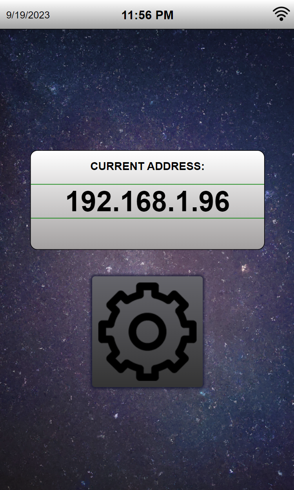

<div align="center">
  
</div>
<br>

<div align="center">
  
</div>
<br>

Close your eyes and take a deep breath. It's January 2020. You think to yourself this is going to be a great year for climbing. You've been climbing hard lately, pushing grades, training hard, and almost flashing the pink one in the corner, nothing can stop you. A couple months go by and your goals for the year are well defined, but you keep hearing talks of some novel virus. You brush it off.

It's now March. Looking at your phone the only headlines you see are about COVID-19. It's spreading quick. There are talks of quarantine measures to be put in place, social distancing, and the closure of public places. As you scroll through this you notice an email from your over-charging perfectly average climbing gym. They're closing their doors until further notice, but they're gladly still accepting your membership fees. Your climbing plans crumble like the choss in New Jack City, but you realize you have to stay in shape somehow. Like everyone else and their grandmother you begin to build a [woody](https://gearjunkie.com/featured/todd-skinner-climbing-woody) and so the PeggyBoard was born.

So what is the PeggyBoard?
- It's a Raspberry Pi project developed to be paired with your home "woody"/climbing wall. It features an easy to use webapp that anyone on your network can open up and begin setting a custom route that will then light up the respective holds on your wall. These routes can also be saved so they can be revisited later.
- It was originally developed for my climbing partner, Liam, for his home wall during the pandemic. He was putting together a 12ft 45° (ouch) wall and wanted to make it more fun/interactive. 

Why not just get a [MoonBoard](https://www.moonboard.com/)?
- The MoonBoard is an awesome product, but at the time their supplies were very low (since everyone was building one) and ~$700 on just the LED System alone ain't cheap.

## Initial Features

<div align="center">
    <table>
        <tr>
            <td>
                <div align="center">
                    
                    <br><b>Figure 1.</b> Route creation page.
                </div>
            </td>
            <td>
                <div align="center">
                    
                    <br><b>Figure 2.</b> Searching for routes previously made.
                </div>
            </td>
            <td>
                <div align="center">
                    
                    <br><b>Figure 3.</b> Saving a route.
                </div>
            </td>
        </tr>
    </table>
</div>

When accessing the app through a mobile device the user is presented with the route creation page as seen in Figure 1. This is where the user can interact with the wall by clicking different dots to set them up as either "Starting Holds" (green), "Foot Holds" (blue), "Hand Holds" (pink), or "Finishing Holds" (red). Each time a user presses on a dot it changes the type and doesn't let you set more than two of "Starting Holds" and "Finishing Holds".

<div align="center">
  
  <br><b>Figure 4.</b> Alternating through holds.
</div>


The user can also view previously saved routes by clicking the folder icon or save their current route by clicking the save icon. When the user is ready to climb one of the routes they can press the light bulb icon and it will then light up the respective holds on the wall as seen in Figure 5.

<div align="center">
  
  <br><b>Figure 5.</b> PeggyBoard displaying a route.
</div>


# Updates
Initially the PeggyBoard only featured a web app and had no way of configuring the WiFi connection to use, what its current IP address is, or deleting saved routes. Years later (now) I decided to add a touch screen to the main control panel and utilize some of the code I wrote for a previous project ([JagerMachine](https://gitlab.com/_Pegor/jagermachine)) to give the PeggyBoard a more user friendly interface for settings and while I was at it I decided to cleanup some of the code and make this project open source. Enjoy! 

<div align="center">
    <table>
        <tr>
            <td>
                <div align="center">
                    
                    <br><b>Figure 6.</b> Control panel main screen.
                </div>
            </td>
            <td>
                <div align="center">
                    
                    <br><b>Figure 7.</b> Settings page.
                </div>
            </td>
            <td>
                <div align="center">
                    
                    <br><b>Figure 8.</b> WiFi list.
                </div>
            </td>
            <td>
                <div align="center">
                    
                    <br><b>Figure 9.</b> WiFi login.
                </div>
            </td>
        </tr>
    </table>
</div>

<br>


## Raspberry Pi Setup Instructions
1)	[Configure Rpi to Kiosk Mode](https://desertbot.io/blog/raspberry-pi-4-touchscreen-kiosk-setup-64-bit-bullseye)
1)	[Enable Root SSH](https://howtovmlinux.com/articles/rasberry-pi/enable-root-login-and-change-password-raspberrypi/)
1)	[Install NGINX Webserver (w/ PHP Installation)](https://pimylifeup.com/raspberry-pi-nginx/)
    1) To restrict the settings page to be only accessed from the control panel the nginx config at `/etc/nginx/sites-enabled/default` was edited and the following was added to the `server` section at the very end:
    ```
        location ^~ /settings {
            allow 127.0.0.1;
            deny all;
        }
    ```
1)  [Setup a MYSQL Database](https://pimylifeup.com/raspberry-pi-mysql/) (name the database 'peggyboardDB' and add a user 'master' with password 'climbhard'). After you have setup the database you will need to create a table named `routes` with a couple fields. You can use the following commands.
    1)  Launch mysql with the created user `master`:
        ```
        mysql -u master -p
        ```
    1)  Switch to use the `peggyboardDB`:
        ```
        use peggyboardDB
        ```
    1)  Create a table named `routes` with the required fields:
        ```
        CREATE TABLE routes (
            id INT(10) unsigned NOT NULL AUTO_INCREMENT,
            routename VARCHAR(30) NOT NULL,
            grade INT(11) unsigned NOT NULL,
            author VARCHAR(30) NOT NULL,
            date TIMESTAMP NOT NULL DEFAULT CURRENT_TIMESTAMP ON UPDATE CURRENT_TIMESTAMP,
            holds MEDIUMTEXT NOT NULL,
            primary key (id));
        ````
    1)  Verify you have created the table properly. If you run the command `DESCRIBE routes` you should see a table like so:
        <div align="center">
            
        </div>
    1)  Exit mysql: `exit`
    
    <br>**NOTE** - IF YOU CHOSE A DIFFERENT DB NAME AND USER MAKSE SURE YOU UPDATE THE FUNCTION `openDatabase()` in `main_backend.php` to the credentials and database name.

1)	[Rotate LCD (optional)](https://osoyoo.com/2019/09/20/instruction-for-raspberry-pi-5-dsi-touch-screen/)
1)	[Enable GPIOs](https://pimylifeup.com/raspberry-pi-gpio/)
1)	[Setup NeoPixel libraries](https://learn.adafruit.com/neopixels-on-raspberry-pi/python-usage)
    ```
    sudo pip3 install rpi_ws281x adafruit-circuitpython-neopixel
    sudo python3 -m pip install --force-reinstall adafruit-blinka
    ```
1)	[Add custom splash  (optional)](https://forums.raspberrypi.com/viewtopic.php?t=276545)
1)  Hide unwanted text from touchscreen:
    1)	Hide autologin message by modifying auto login service:
        ```
        sudo nano /etc/systemd/system/getty@tty1.service.d/autologin.conf
        ```
        Replace
        ```
        ExecStart=-/sbin/agetty --autologin pi --noclear %I xterm-256color
        ```
        with:
        ```
        ExecStart=-/sbin/agetty --skip-login --noclear --noissue --login-options "-f pi" %I $TERM
        ```
    1) Hide xorg messages by modifying `bash_profile`:
        ```
        sudo nano ~/.bash_profile
        ```
        Replace
        ```
        [[ -z $DISPLAY && $XDG_VTNR -eq 1 ]] && startx -- -nocursor
        ```
        with:
        ```
        [[ -z $DISPLAY && $XDG_VTNR -eq 1 ]] && startx >/dev/null 2>&1 -- -nocursor
        ```
    1) Hide boot text and blinking cursor by modifying `cmdline.txt`:
        ```
        sudo nano /boot/cmdline.txt
        ```
        Add this the end. Make sure cmdline.txt contents are all on a single line.
        ```
        console=tty3 logo.nologo loglevel=3 splash silent quiet vt.global_cursor_default=0

        ```
    1) Hide Linux information text by modifying `10-uname` script to comment out call of `uname`:
        ```
        sudo nano /etc/update-motd.d/10-uname
        ```
        Comment out `uname` call by adding a "#" behind it.
    1) Hide copyright text by removing all test inside `motd` file.
        ```
        sudo nano /etc/motd
        ```
        Remove all text there.


    1) Hide "Last login..." text by creating `.hushlogin` file on home directory:
        ```
        cd $HOME && touch .hushlogin
        ```

1)  Clone the repo to the base directory of the Raspberry Pi and copy the folders in the `Software` folder (`custom_scripts`, `html`) to `/var/www/`. 
    *  \**If the repo is cloned to a different location be sure to update `updateScript.sh`.*
1)	[Give root privilege to custom script `runRoot.sh`](https://superuser.com/questions/1448987/allow-php-to-run-shell-script-with-sudo-permission)
1)  Make `runRoot.sh`, `connectToWifi.sh`, and `updateScript.sh` into executables:
    ```
    chmod +x runRoot.sh && chmod +x connectToWifi.sh
    ```

## Hardware
### Parts
* [Raspberry Pi 3B](https://www.raspberrypi.com/products/raspberry-pi-3-model-b/) (Reccommend 3B+ or newer to avoid 5Ghz WIFI issues)
* [SD Card 64gb](https://a.co/d/9vveZ4f)
* [3.3V to 5V Level Shift (for LEDs)](https://www.amazon.com/HiLetgo-Channels-Converter-Bi-Directional-3-3V-5V/dp/B07F7W91LC)
* [5V 30A Power Supply](https://a.co/d/6RfqMce)
* Addressable LEDs (Pretty sure I ordered them from AliExpress and asked them to extend the wires for me).
* [3 Pin Connector](https://a.co/d/3ugV90X)
* [2 Pin Connectors](https://a.co/d/aJmRtPK)
* [Screw Terminal Blocks](https://a.co/d/0riAlfw)
* [Case (Project box would be better)](https://a.co/d/aq2SHM4)
* [Touchscreen](https://www.aliexpress.us/item/3256804013190983.html?gatewayAdapt=glo2usa4itemAdapt)

<p>
The control panel for the PeggyBoard was housed inside of a fireproof safe. Looking back it would have been way easier dealing with a project box of similar size. The panel contains the Raspberry Pi, power supply, 3.3V to 5V level shifter, two terminal blocks, 3 2-pin connectors, 3-pin connector, and a touchscreen. It looks like a rats nest but it's a rather simple setup. The schematic in Figure 10 is a simplified version of the finished product seen in Figure 10. The use of a 3v3 to 5v level shifter was necessary since the Raspberry Pi handles logic in 3v3, but the addressable LEDs expect 5V. The reason behind the 3 2-Pin connectors is due to voltage drop across the LEDs. Powering 400 LEDs from a single terminal is a bad idea. Not only will that terminal get extremely hot (even melt wires if too low gauge) it would also show a visible color change in LEDs the further out they are. To avoid this the 400 LED strip was split into 4 sections where each section ran a separate 5v and GND connection, but maintained the same signal line from the previous section as seen in Figure 12.


<div align="center">
    <table>
        <tr>
            <td>
                <div align="center">
                    
                    <br><b>Figure 10.</b> Control panel schematic.
                </div>
            </td>
            <td>
                <div align="center">
                    
                    <br><b>Figure 11.</b> Control Panel.
                </div>
            </td>
        </tr>
    </table>
</div>

<div align="center">
  
  <br><b>Figure 12.</b> LED strip connections.
</div>
<div align="center">
  
  <br><b>Figure 13.</b> LED bulbs on the back of the wall.
</div>
<div align="center">
  
  <br><b>Figure 14.</b> The PeggyBoard control panel.
</div>


### Contact
[Buy me a Coffee!](https://www.buymeacoffee.com/pegor)
<br>
devPegor@gmail.com